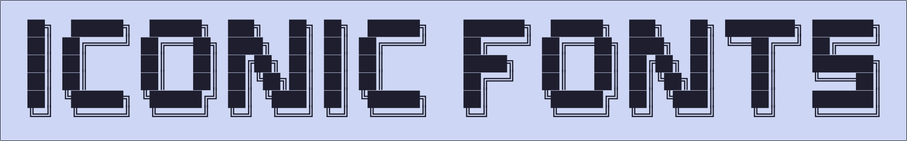
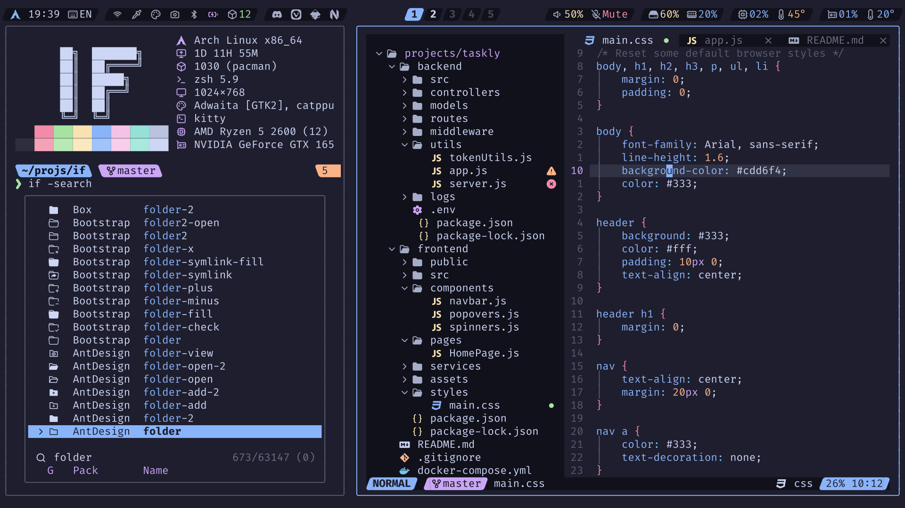
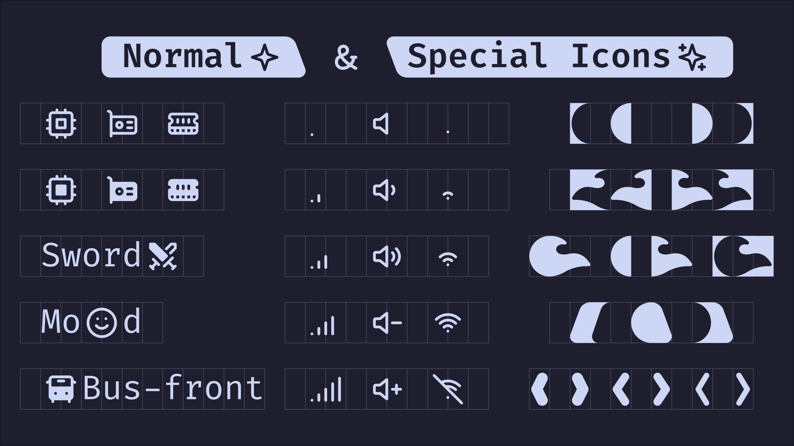
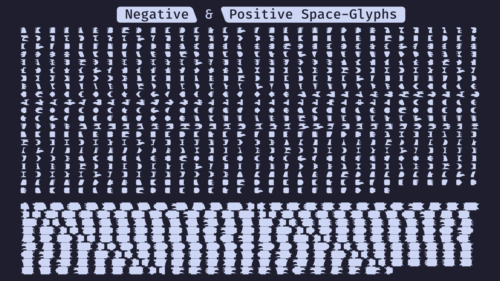

# Iconic Fonts

> [!Warning]
> This project is no longer maintained and has been closed.
>
> Due to limited interest and different Unicode support compared to [Nerd Fonts](https://github.com/ryanoasis/nerd-fonts), this project has been discontinued.

Over **50 Pre-patched** fonts designed for enthusiasts who love to rice their terminal, window manager, and more, featuring over **60k icons** as glyphs for ultimate customization and flair!

## Icon Types and Alignment

Iconic Fonts includes two types of icons: normal and special. Normal icons use 2 columns and are centered vertically and horizontally within the font block. Special icons do not follow any specific rule and may use single or double columns; for some, is determined by the icon coordinates.

## Modern Line Symbols

Similar to Powerline and [Powerline Extra Symbols](https://github.com/ryanoasis/powerline-extra-symbols), Modern Line Symbols consist of unique icons used in status bars for window managers or terminals. They include a variety of icons needed for status bars and come in two types: positive space icons, which are solid and fill the design area, and negative space icons, which are hollow or outlined, using the surrounding space to create the design. With over 70 shapes to choose from, you can combine these to create more than 1,000 distinct icons shapes.

